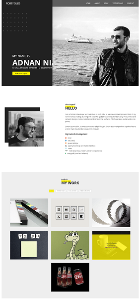
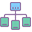

## My Personal Portfolio as my First Full Custom Front-End Project
##  Objective:
A fully custom Portfolio design with responsive approach. This front-end project is completed using HTML, CSS and JavaScript.

## [Visit Portfolio](https://adnanniaz77.github.io/new_portfolio/)

## SnapShot

#  Focused Areas
    a.   Custom Design (from Design to deployment)
    b.   Mobile Responsiveness
    c.   Responsive Menu
    d.   Custom JS interactivity
    e.   JS Filtered Gallery

#  Technologies
 -   Figma
 -   HTML
 -   CSS
 -   JS
 -   Responsive

#  WorkFlow 
 - Design drawn on paper
 - Converting the paper design to Figma
 - Finalizing design, color, fonts and typography in Figma
 - Start Markup the HTML
 - Apply styling using CSS
 - Making interactivity using JavaScript

#  Improvements
    -   Applying smooth transition to Filtered Gallery
    -   Find solution to remove quirky behavior in the Floating-menu
    -   Improve Responsive Menu design and position
    -   Add functionality for contact form
